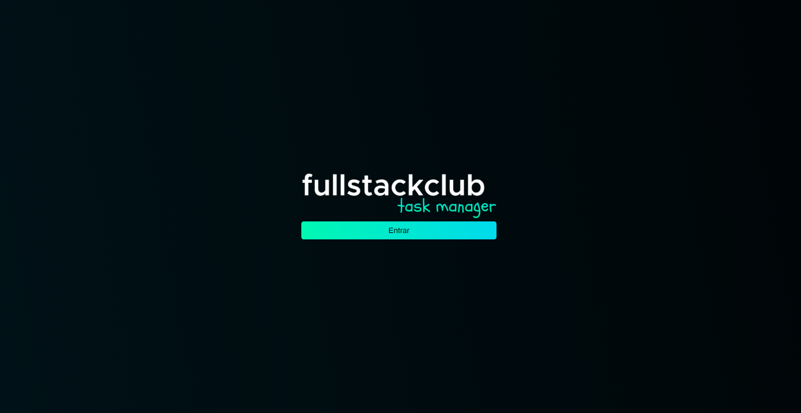
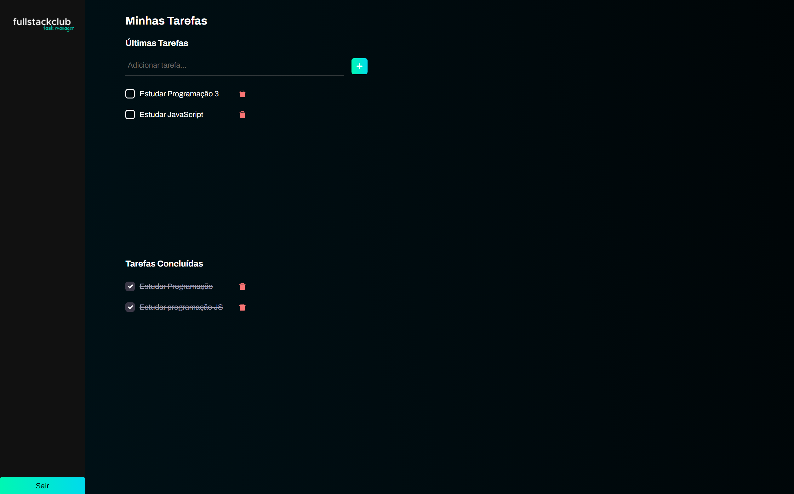

<h2>Task Manager</h2>

App no qual você pode criar suas tarefas diárias.

A imagem abaixo é a página de Login, onde o usuário deverá clicar no botao de Entar.

Já a segunda Imagem é a aplicação sendo executada

Nela você pode Adicionar, Marcar como Executada e Excluir as tarefas.

